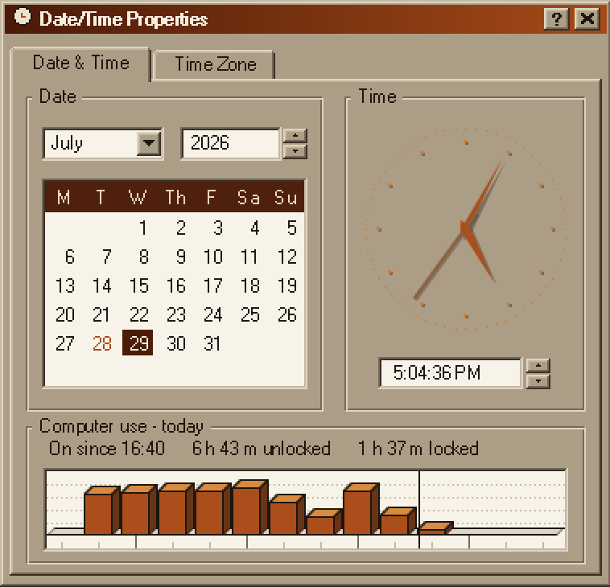
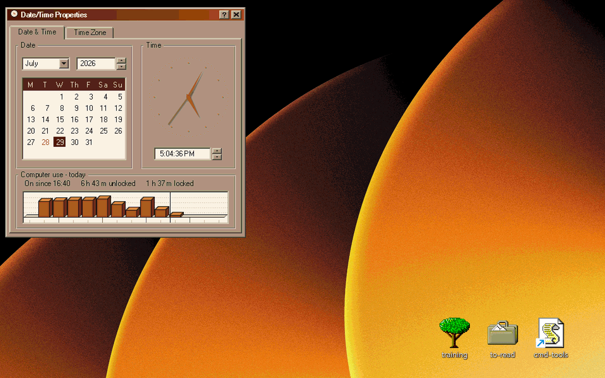
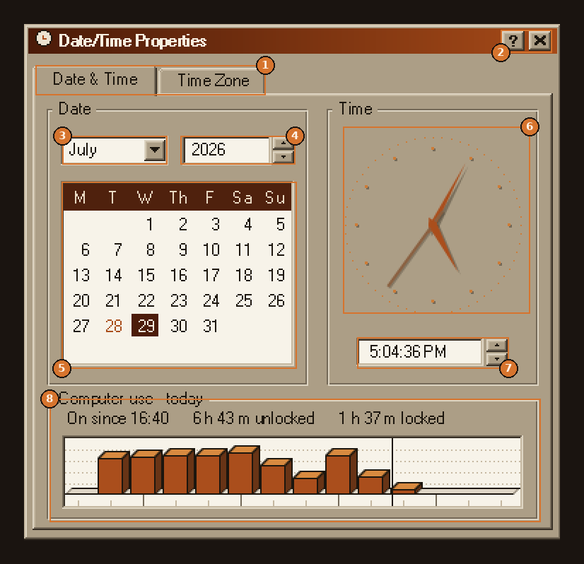
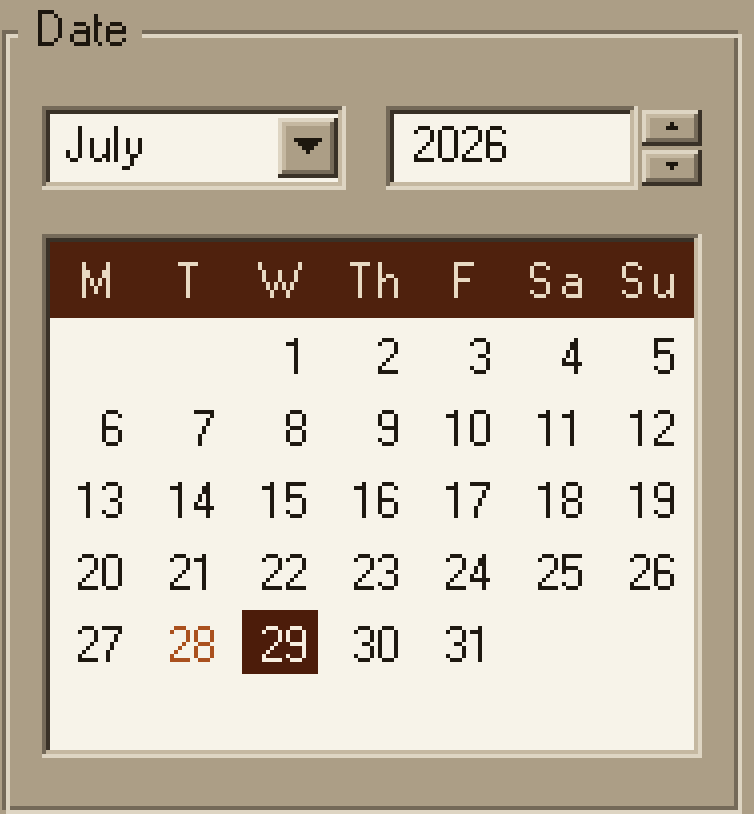
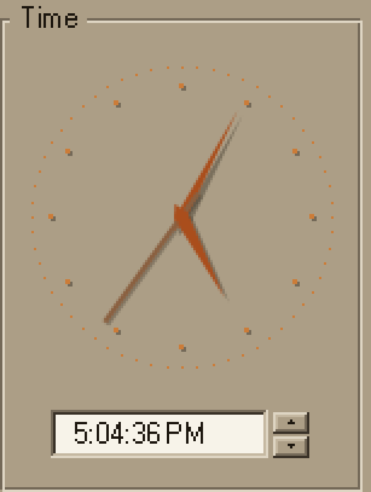
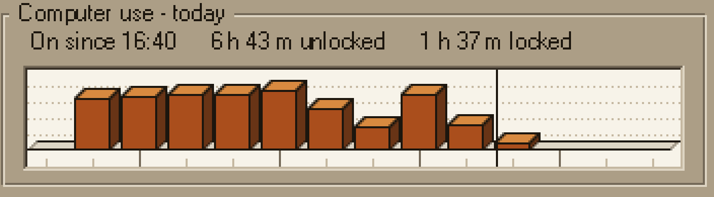

<h1 align="center">Win98 Date/Time Properties</h1>

<p align="center">
  A pixel reconstruction of the Windows&nbsp;98 Date/Time Properties dialog, in a warm
  golden&nbsp;/ orange-brown scheme — with a browsable calendar, shadowed clock hands,
  and a log of when this computer was on and unlocked.
</p>

<p align="center">
  
  
  
</p>

<p align="center">
  
</p>

---

## At a glance

- **A real Win98 dialog, not a pastiche** — two-ring sunken fields, group boxes with
  notched labels, a tab strip that actually switches pages.
- **A browsable calendar.** Scroll to change month, click a day to inspect it,
  double-click to come home.
- **An analogue clock** with shadowed hands, and a time field that toggles
  12-hour / 24-hour on click.
- **A usage graph** in the fake 3D of a Win98-era charting control: one block per
  hour, showing how much of that hour the machine was on and unlocked.
- **No helper process, no scheduled task, no elevation, no network.** Two facts
  observed once a second are enough (see
  [How the day is reconstructed](#how-the-day-is-reconstructed)).

<p align="center">
  
</p>

---

## Install

1. Install [Rainmeter](https://www.rainmeter.net) if you don't have it. **4.5 or later** —
   the skin uses the built-in `Process` measure and the `USER_LOGONTIME` system value,
   neither of which exists in 4.4.
2. Copy the whole `Win98DateTime` folder into your skins folder:

   ```text
   Documents\Rainmeter\Skins\
   ```

   so that you end up with:

   ```text
   Documents\Rainmeter\Skins\Win98DateTime\Win98DateTime.ini
   ```

3. Right-click the Rainmeter tray icon → **Refresh all**.
4. Tray icon → **Skins** → **Win98DateTime** → **Win98DateTime.ini**.

There is nothing else to set up. The first day looks sparse because the log starts
empty; from the second day on it covers the whole day.

---

## Guided tour

<p align="center">
  
</p>

|   | Element | What it does |
|:-:|---------|--------------|
| **1** | Tab strip | Click to switch between **Date & Time** and **Time Zone**. The usage panel is visible on both. |
| **2** | `?` and `X` | About window, and unload the skin. |
| **3** | Month field | Click for a 12-month dropdown; scroll on it to step month by month. |
| **4** | Year field | The arrows jump a year back / forward. |
| **5** | Calendar grid | Click a day to select it — the usage panel follows the selection. Scroll anywhere in the grid to browse months, double-click to return to today. Days that have a record show their number in orange. |
| **6** | Clock | Hour, minute and second hands, each with its own shadow. |
| **7** | Time field | Click to toggle 12-hour / 24-hour. Scroll up for 24-hour, down for 12-hour; the spinner arrows do the same. |
| **8** | Computer use | The day the calendar has selected, one block per hour. |

There are no hover tooltips.

### Full controls reference

| Control | Action |
|---------|--------|
| Date & Time / Time Zone tabs | click to switch pages |
| Month field | click for a 12-month dropdown; scroll to step month by month |
| Year arrows | jump a year back / forward |
| Calendar day | click to select that date; the usage panel follows |
| Calendar (anywhere) | scroll to browse months, double-click to return to today and clear the selection |
| Time field | click to toggle 12-hour / 24-hour; scroll up for 24-hour, down for 12-hour |
| Time spinner arrows | up = 24-hour clock, down = 12-hour |
| `?` button | opens the Rainmeter About window |
| `X` button | unloads the skin |

---

## The panels

### Date



The month is a dropdown and a scroll target; the year has spinner arrows. `WeekStart`
decides whether the week opens on Monday or Sunday.

Today is boxed. A day you have clicked is highlighted, and the usage panel below
follows that selection until you double-click to clear it.

Any day the log has something for prints its number in **orange** — the same ink the
blocks in the graph are drawn in — so a month at a glance shows which days are on
record.

<br clear="all">

### Time



Three hands, each with a shadow offset beneath it — alpha 110 for the hour and minute
hands, 90 for the second hand, all set in the `MeterHand*Shadow` meters.

The outer ring and the second hand can both be switched off (`HideRing`, `HideSeconds`).

The field below is sunk into the dialog with the same two-ring edge as the other
fields, and toggles 12-hour / 24-hour on click. That choice lives in the script rather
than in a skin variable, so it works even when the skin sits in a write-protected
folder.

<br clear="all">

### Computer use

<p align="center">
  
</p>

The panel shows the day the calendar has selected — today unless you click another
date — as a chart in the fake 3D of a Win98-era charting control, one block per hour.

<details>
<summary><b>The shape of it, in ASCII</b></summary>

```text
Computer use - today
On since 14:30      9h 04m unlocked      46m locked
 ______________________________________________
| - - - - - - -__ - - - - - - - - - - - - - - -|
| - - - -__ - |##\ - -__ - - - - - - - - - - - |
| - - - |##\ _|##|| _|##\ - -__ - - - - - - - -|
| -__ - |##||##|##|||##|##\ -|##\ - - - - - - -|
|_|##\__|##||##|##|||##|##||_|##||_____________|
|__'_____'____'____'____'____'____'____'_______|
   07   08   09   10   11   12   13   14 ...
```

</details>

**How a block is drawn.** Each block's height is the unlocked minutes of that hour,
against a field exactly sixty minutes tall — all an hour can hold — with a dotted
gridline every fifteen. The blocks stand on a stippled floor, and every one is built
the same way: an outlined front face, a lit top, a shaded side, both receding a few
pixels up and to the right. An hour with only a couple of unlocked minutes still gets
a small block rather than rounding to nothing.

**The window.** The graph covers **07:00 to 21:00** — not the whole 24 hours, since the
small hours are rarely what you want to see — with a tick centred under each block and
a full-height one every third hour. It is sunk into the dialog like the time field.

**What the colours mean.** Orange is time the computer was on and unlocked. Everything
else is blank: locked time, time the machine was off or asleep, and time Rainmeter was
not running all read the same on the graph. Locked time is still *measured* — it is in
the totals line — it just is not drawn.

**The "now" mark.** A thin vertical mark shows where now falls. It travels across the
current hour's block and hops to the next on the hour, and disappears outside
07:00–21:00 rather than pinning itself to an edge and claiming a time that is not now.

**"On since"** is the start of the latest unlocked session. Locking the machine ends a
session, so after lunch it shows when you sat back down, not when you first signed in.
Stepping away does not blank it: while the machine is locked it keeps showing the
session you just had. On a past day it reads *"Last session from"* instead.

**The totals** cover the whole day, including anything outside 07:00–21:00, so they can
exceed what the graph shows. If they add up to less than the time between the session
start and now, the difference is time the machine was off or asleep.

---

## How the day is reconstructed

Rainmeter keeps ticking while the workstation is locked, so two facts are enough — with
no helper process, no scheduled task and no elevation:

1. the script ran at second `T` → the machine was on at `T`
2. `LogonUI.exe` is running → the lock screen is up

A tick that arrives more than **90 seconds** after the previous one means the machine
was off, asleep, or Rainmeter was not running in between, so the interval is closed at
the last tick actually observed rather than being stretched across the gap. Everything
else is one continuous interval, tagged unlocked or locked.

At load, the skin reads your Windows sign-in time. If it started within **ten minutes**
of you signing in — the normal case when Rainmeter starts with Windows — the session is
dated from the sign-in rather than from whenever Rainmeter got going, so the "On since"
figure matches when you actually sat down.

<details>
<summary><b>Known limits</b>, in the spirit of not overstating what this can see</summary>

- It cannot know about time before Rainmeter started, beyond that one sign-in reading.
  Quit Rainmeter for an hour and that hour is a gap.
- "Locked" means the lock screen is up for *anyone*. With fast user switching, another
  account's lock screen counts as locked for you too.
- `LogonUI.exe` restarts by itself while the lock screen's display sleeps, and for the
  second or two it is gone the probe reads as unlocked. Closed unlocked stretches
  shorter than `MIN_UNLOCK` in `Skin.lua` (30 seconds) are therefore treated as noise
  and left out of the graph, the totals and the session start. They are still written
  to the log exactly as observed, so lowering the threshold brings them back without
  losing history.
- Sleep and hibernate are indistinguishable from a shutdown here, which is the intent:
  in all three cases you were not using the machine. This is also why the skin does not
  use system uptime, which Windows 8 and later do not reset on a normal shutdown.
- A remote desktop session that disconnects without locking looks like unlocked use.

</details>

---

## The usage log

Plain text, one interval per line, pruned to the last `HistoryDays` days:

```text
# Win98 Date/Time usage log -- delete this file to forget it.
# date       from     to       U = unlocked, L = locked
2026-07-28 08:16:04 12:03:12 U
2026-07-28 12:03:12 12:41:30 L
2026-07-28 12:41:30 14:30:07 U open
```

The interval still running carries `open`, and its end time is a provisional "last
seen", rewritten every two minutes. Intervals never straddle midnight, so a day's total
is a plain sum of its lines. Deleting the file forgets everything; the skin makes a new
one on the next tick.

Location — the first of these that is writable:

```text
%LOCALAPPDATA%\Win98DateTime\Usage.log
%LOCALAPPDATA%\Win98DateTime.log
the skin folder
```

It deliberately avoids `Documents`, which is OneDrive-redirected on many managed
machines and shielded by Controlled Folder Access, so script writes there fail. If none
of the three can be opened, the skin still runs and the panel still works — the record
just does not survive a refresh or a reboot.

---

## Customization

Everything below lives in `[Variables]` in `Win98DateTime.ini`.

| Variable | Default | What it does |
|----------|:-------:|--------------|
| `Pad` | `12` | empty margin around the dialog (screen-edge breathing room) |
| `WeekStart` | `1` | `1` = Monday first, `0` = Sunday first |
| `Use24Hour` | `1` | also set by clicking the time field |
| `HideSeconds` | `0` | hide the second hand |
| `HideRing` | `0` | hide the clock's outer ring |
| `HistoryDays` | `31` | how many days of log to keep |
| `UseInk` / `UseTop` / `UseSide` | — | the three faces of a block: the front you look at, the lit top, the shaded right side. Days that have a record use `UseInk` for their number too |
| `Face` / `Hilite` / … | — | the whole chrome palette is variables; recolor freely |

**Geometry** — these come in pairs, and the second half of each pair has hand-written
values that assume the first:

- `GraphFrom=7`, `GraphTo=21` — the hours the graph covers. The hour ruler and gridlines
  in `[MeterUseTrough]` are drawn to match, so change them together. Any window up to
  the full day fits: the blocks narrow, and squeeze their spacing when they must.
- `BarX` / `BarY` / `BarW` / `BarH` — where the graph's blocks go; `BarH` is the height
  of the block field. `[MeterUseTrough]` frames it with the same two-ring sunken edge
  the other fields use (2px per side) and gives the interior eight extra rows at the
  bottom for the hour ruler, so change the two together — the gridlines, floor and tick
  positions there are all spelled out against the default geometry. Making the field
  taller means growing `[MeterUseBox]`, `[MeterPanel]` and `[MeterFrame]` to match, or
  the dialog will crowd it.
- **Shadow strength** — the alpha values in the three `MeterHand*Shadow` meters
  (110 for hour/minute, 90 for second).

Knobs that change behaviour rather than colour — the 90-second gap, the two-minute
flush, the ten-minute sign-in window, the blocks' depth and spacing, and the smallest
block worth drawing — are named constants at the top of `Skin.lua`. The depth is
mirrored by the floor in `[MeterUseTrough]`, so change the two together.

---

## Files

| File | |
|------|--|
| `Win98DateTime.ini` | skin layout (pure layout, no logic) |
| `Skin.lua` | the brain: clock, calendar, usage log |
| `README.md` | this file |
| `Usage.log` | the journal, created on first run outside the skin folder (see [The usage log](#the-usage-log)) |
| `docs/` | the images in this README |

---

## Upgrading from v3.x

<details>
<summary>The Outlook / Microsoft Graph feed is gone, along with everything that supported it.</summary>

<br>

Delete these from the skin folder — nothing references them any more:

| | |
|--|--|
| `Calendar.lua` | replaced by `Skin.lua` |
| `OutlookSync.ps1` | the Graph sync |
| `Sync.vbs` | the silent launcher for it |

Also safe to delete, if you want the meeting titles off the disk:

```text
%LOCALAPPDATA%\Win98DateTime\Meetings.txt
```

You can revoke the calendar permission the sync used at
[myaccount.microsoft.com](https://myaccount.microsoft.com) → **Privacy**, under the
*Microsoft Graph Command Line Tools* app. The skin no longer talks to the network at
all.

</details>

---

## Notes on how it is put together

The `.ini` is pure layout. `Skin.lua` computes everything and pushes it out as skin
variables, and the meters that display them are grouped (`Calendar`, `Session`,
`TimeZone`, `MonthList`) so a change repaints one group instead of the whole skin. A
quiet second costs three angle variables, one time string and one measure read; the
panel, the calendar grid and the time zone page are recomputed on the minute or when
you click something.

The 12/24-hour choice lives in the script, which is why it now works: the spinner used
to write a skin variable with `!WriteKeyValue`, which silently fails when the skin sits
in a write-protected folder. The variable is still written, last and best-effort, so the
setting survives a refresh — but the display no longer depends on that write
succeeding.

*(The other half of the old bug: 12-hour mode rendered no AM/PM and 24-hour mode had no
zero padding, so at 09:45 both modes produced the same string and the buttons looked
dead even when they had worked.)*
